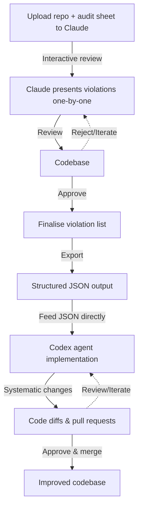

# LLM Code Audit Framework

AI-optimised audit sheets for systematic code quality assessment. Transform manual auditing into structured, agent-driven quality assurance.

## Available Audits

### [Accessibility](accessibility/) - WCAG 2.2 Compliance

- 27 audit areas covering WCAG guidelines
- Next.js and Tailwind-specific patterns
- False positive prevention protocols
- Automated contrast ratio validation

### [Security](security/) - Vulnerability Assessment

- 19 security domains for Next.js applications
- Authentication and authorisation verification
- Input validation and injection prevention
- Production security configuration

## Quick Start

1. **Upload project** + audit sheet to LLM
2. **Run structured audit** using provided methodology
3. **Review violations** one-by-one with proposed fixes
4. **Export JSON** for implementation agents

```bash
# Basic workflow
git clone https://github.com/TandemCreativeDev/llm_nextjs_audit_sheets.git
# Upload files + accessibility/AUDIT.md or security/AUDIT.md to LLM
# Follow interactive audit process
# Apply fixes via JSON output
```

## Audit Output

Standardised JSON format across all audit types:

```json
{
  "issue": "unique-id",
  "severity": "Critical|Serious|Moderate|Minor",
  "location": "file:line",
  "description": "specific violation",
  "fix": {
    "before": "problematic code",
    "after": "corrected code",
    "effort": "Low|Medium|High"
  }
}
```

## Recommended Workflow

This approach becomes significantly more practical when using [OpenAI's Codex agents](https://openai.com/index/introducing-codex/) to implement the improvements scoped with Claude. Rather than manually applying dozens of changes across components, the structured audit process produces JSON output that feeds directly into Codex agents for systematic implementation.



**The process in detail:**

1. **Audit phase**: Claude (or preferred LLM) reads codebase using audit methodology, identifies violations
2. **Interactive scoping**: Claude presents each violation individually with proposed fix - you approve, request changes, or reject
3. **JSON export**: Once all violations reviewed, Claude outputs structured JSON with approved changes
4. **Direct implementation**: Feed JSON into Codex agents (or preferred agentic coding agents) which systematically apply the specified fixes across the repository
5. **Review & integration**: Examine diffs and merge pull requests

The key insight is the structured JSON acts as a bridge between intelligent auditing (Claude) and systematic implementation (Codex). What previously required manual coordination now flows seamlessly from audit to implementation.

## Integration

### Codex Agent Input

```markdown
Apply accessibility fixes from audit JSON:
[PASTE COMPLETE JSON OUTPUT]

Work through each fix systematically, maintaining code quality and testing.
```

### CI/CD Pipeline

```yaml
- name: Code Quality Audit
  run: |
    # Upload codebase + audit sheets to LLM
    # Process structured JSON output
    # Feed approved changes to implementation agents
```

## Methodology

**Zero False Positives**: Every violation requires actual confirmation

- Test dynamic functionality before flagging
- Calculate real metrics (contrast ratios, response times)
- Verify existing implementations
- Understand contextual usage

**Structured Process**: Interactive violation review

- Present each issue individually with specific evidence
- Propose targeted remediation approach
- Allow approval/modification before proceeding
- Export final validated results

## Expanding Framework

Future audit sheets will follow the same pattern:

- **Performance**: Core Web Vitals, bundle analysis, caching
- **Code Quality**: Architecture patterns, maintainability
- **Testing**: Coverage gaps, test quality assessment
- **Documentation**: API docs, code comments, README completeness

Each audit maintains:

- LLM-optimised methodology
- False positive prevention
- Interactive violation process
- Standardised JSON output
- Implementation agent compatibility

## Coverage

**Automated Detection**: 60-70% of common issues via pattern matching
**Manual Verification**: 30-40% requires human judgment  
**Agent Implementation**: 80-90% of fixes can be automated

Built for development teams who need systematic quality assurance without the overhead of manual auditing processes.
